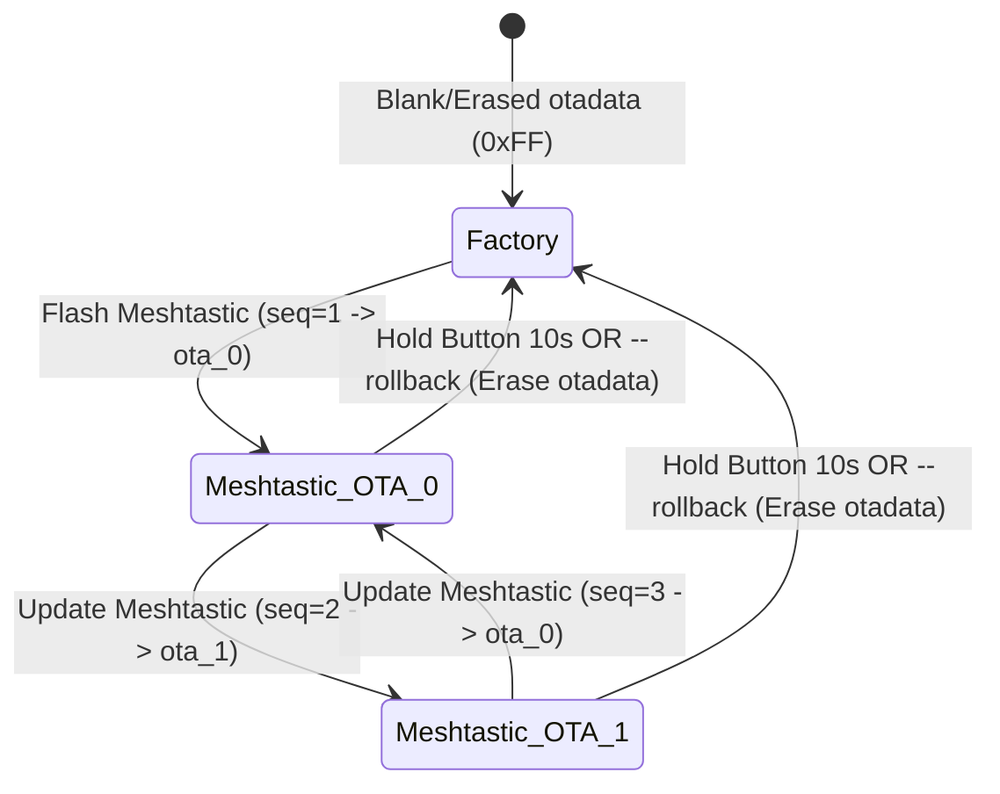

# WeatherXM WG1200 (D1 Gateway) Meshtastic Variant & Dual-Firmware Architecture

## 1. Executive Summary

The WeatherXM WG1200 (D1 Gateway) features an ESP32-S3 microcontroller with hardware Secure Boot V2 and a 16MB SPI flash. To allow community exploration without risking bricked devices or losing factory WeatherXM identity, this variant implements a **non-destructive dual-firmware system**:

$$\text{WeatherXM (Factory)} \longleftrightarrow \text{Meshtastic (OTA)}$$

A production WG1200 can transition back and forth between WeatherXM and Meshtastic indefinitely.

---

## 2. Core Safety Invariants

1. **Immutable Factory Partition (`0x020000`)**:
   The stock WeatherXM firmware is located at partition `factory` (`0x020000`, 4MB). Neither the Meshtastic flasher nor runtime code ever overwrites or erases this partition.
2. **Alternating Inactive OTA Targets**:
   Meshtastic is flashed strictly to the unused OTA partition:
   - When running `factory`: Flashes to `ota_0` (`0x420000`).
   - When running `ota_0`: Flashes to `ota_1` (`0x820000`).
   - When running `ota_1`: Flashes to `ota_0` (`0x420000`).
3. **Partition Geometry Verification**:
   Before writing any byte to flash, the flasher tool reads the binary partition table from `0x0C000` and validates that `factory`, `ota_0`, `ota_1`, and `otadata` exist at exact designated offsets.
4. **Hardware Button Rollback (10 Seconds)**:
   Holding the external user button (**GPIO 38**) for **10 seconds** at power-on triggers `earlyInitVariant()` in Meshtastic, which erases `otadata` and restarts the device directly into the factory WeatherXM firmware.
5. **NVS Namespace Isolation**:
   Performing a "Factory Reset" in Meshtastic does **not** call `nvs_flash_erase()`. Instead, it purges only Meshtastic-specific namespaces (`meshtastic`, `nimble_bond`, `nimble_sec`, `nvs.net80211`), keeping WeatherXM device identity, provisioning certificates, and sensor calibration untouched.

---

## 3. Flash Memory Geometry (16MB)

| Partition | Subtype | Offset | Length | Description | Protection Level |
| :--- | :--- | :--- | :--- | :--- | :--- |
| **`esp_secure_cert`** | Custom (0x3F) | `0x00D000` | `0x002000` (8 KB) | Factory Device Certificate & DS Identity | **READ-ONLY / PREFLIGHT PROTECTED** |
| `nvs` | NVS (0x02) | `0x00F000` | `0x004000` (16 KB) | Shared Non-Volatile Storage | Namespaced writes only |
| `otadata` | OTA Selection (0x00) | `0x013000` | `0x002000` (8 KB) | 2x 4KB sectors controlling active boot slot | Managed by bootloader & flasher |
| **`factory`** | App Factory (0x00) | **`0x020000`** | **`0x400000`** (4 MB) | **Original WeatherXM Stock Firmware** | **READ-ONLY / IMMUTABLE** |
| **`ota_0`** | App OTA 0 (0x10) | **`0x420000`** | **`0x400000`** (4 MB) | Primary Meshtastic Boot Slot | Overwritten only when inactive |
| **`ota_1`** | App OTA 1 (0x11) | **`0x820000`** | **`0x400000`** (4 MB) | Secondary Meshtastic Boot Slot | Overwritten only when inactive |
| `spiffs` | SPIFFS (0x82) | `0xC21000` | `0x3DF000` (~3.8 MB) | LittleFS / Storage filesystem | Meshtastic storage |

---

## 4. How Boot Switching Works

### ESP-IDF `otadata` Mechanics
The ESP-IDF bootloader determines which partition to boot by reading the 8KB `otadata` partition at `0x013000`:
* Sector 0 (`0x013000 - 0x013FFF`)
* Sector 1 (`0x014000 - 0x014FFF`)

Each sector contains an `esp_ota_select_entry_t` (32 bytes) with:
* `ota_seq`: 32-bit integer incremented with each update.
* `crc`: 32-bit CRC over `ota_seq` (`binascii.crc32(pack('<I', seq), 0xFFFFFFFF) % 2^32`).



1. **Factory State**: When `otadata` contains `0xFF`s (empty/uninitialized), the bootloader automatically boots `factory` (`0x020000`).
2. **First Meshtastic Flash**:
   - Flasher checks `otadata`, detects `factory` is active.
   - Signs binary with Secure Boot V2.
   - Writes binary to `ota_0` (`0x420000`).
   - Writes Sector 0 in `otadata` with `ota_seq = 1` and valid CRC32.
   - On reboot, bootloader boots `ota_0`.
3. **Subsequent Meshtastic Updates**:
   - Flasher queries `otadata`. If `ota_0` is active (`seq = 1`), it writes to `ota_1` (`0x820000`) with `seq = 2`.
4. **Returning to WeatherXM**:
   - Rollback clears `otadata` with `0xFF`.
   - On the next boot, ESP-IDF bootloader sees no valid OTA slot and boots `factory` (`0x020000`).

---

## 5. Hardware Button Rollback (10 Seconds)

The WG1200 user push button is connected to **GPIO 38** (active LOW, normally pulled HIGH).

During early boot, `earlyInitVariant()` in `src/platform/extra_variants/weatherxm_wg1200/variant.cpp`:
1. Samples GPIO 38 before higher-level subsystems start.
2. If held `LOW`, it loops for **10 full seconds (10,000 ms)**.
3. If released before 10s, rollback cancels and Meshtastic boots normally.
4. If held for the full 10s:
   - Erases the `otadata` partition (`0x013000`).
   - Calls `esp_restart()`.
   - ESP-IDF bootloader boots stock WeatherXM from `factory` (`0x020000`).

---

## 6. Flasher Tool Reference (`wg1200_upload.py`)

The upload script is located at `variants/esp32s3/weatherxm-wg1200/wg1200_upload.py`.

### Standard PlatformIO Build & Upload
```bash
pio run -e weatherxm-wg1200 -t upload
```
PlatformIO automatically invokes `wg1200_upload.py`, which finds the signing key, verifies the partition layout, targets the inactive OTA slot, and updates `otadata`.

### Inspect Boot Status
To inspect active boot slot and verify partition table without modifying flash:
```bash
python variants/esp32s3/weatherxm-wg1200/wg1200_upload.py --status [port]
```

### Revert to Factory WeatherXM Firmware via Software
```bash
python variants/esp32s3/weatherxm-wg1200/wg1200_upload.py --rollback [port]
```

---

## 7. Meshtastic NVS Factory Reset Isolation

In standard Meshtastic, node factory reset calls `nvs_flash_erase()`. On WeatherXM hardware, this would wipe claiming certificates, MAC keys, and barometric/thermal calibration.

On WG1200 (`src/mesh/NodeDB.cpp`), NVS reset is scoped strictly to Meshtastic namespaces:
```cpp
#if defined(WG1200)
    Preferences preferences;
    if (preferences.begin("meshtastic", false)) {
        preferences.clear();
        preferences.end();
    }
    const char *meshtastic_nvs_namespaces[] = {"nimble_bond", "nimble_sec", "nvs.net80211", NULL};
    for (int i = 0; meshtastic_nvs_namespaces[i] != NULL; i++) {
        nvs_handle_t handle = 0;
        if (nvs_open(meshtastic_nvs_namespaces[i], NVS_READWRITE, &handle) == ESP_OK) {
            nvs_erase_all(handle);
            nvs_commit(handle);
            nvs_close(handle);
        }
    }
#else
    nvs_flash_erase();
#endif
```
This safely clears node channels, BLE bonds, and WiFi credentials, while leaving WeatherXM credentials and factory sensor calibration completely intact.

---

## 8. Historical Bootloader Analysis & Hardware Safety (Pin 10 vs Pin 38)

### The GPIO 10 Bootloader Bug
Disassembly analysis of the stock 2nd-stage bootloader on early production units (compiled **May 27, 2024 at 11:52:34**) revealed that `CONFIG_BOOTLOADER_FACTORY_RESET` was enabled on **GPIO 10** with a 5-second hold threshold:
```assembly
403c99f1: movi.n a12, 0      ; active level = LOW
403c99f3: movi.n a11, 5      ; hold time = 5 seconds
403c99f5: movi.n a10, 10     ; pin = GPIO 10!
403c99f7: call8  bootloader_common_check_long_hold_gpio_level
403c99fc: bnei   a10, 1, 0x403c9a54
403c9a07: l32r   a10, "Detect a condition of the factory reset"
```

On WG1200 hardware, **GPIO 10 is the ST7701 LCD RGB data line (G0)**. When the display is active or during warm reset, this line can be pulled low by the display controller or uninitialized pad circuitry. If held low for 5 seconds at boot, the bootloader triggers a hardware factory reset, wiping `otadata` and `nvs`.

### Defense-in-Depth in Meshtastic
To ensure total immunity against false factory resets on units with this bootloader:
1. **Early Boot Pin Conditioning (`earlyInitVariant`)**:
   GPIO 10 is immediately configured as `GPIO_MODE_INPUT_OUTPUT`, driven HIGH, and its pad hold is released.
2. **Warm Reset Pad-Hold (`esp_register_shutdown_handler`)**:
   A shutdown hook drives GPIO 10 HIGH and engages hardware pad hold (`gpio_hold_en(GPIO_NUM_10)`) across warm resets and software restarts.
3. **OTA Rollback Cancellation (`esp_ota_mark_app_valid_cancel_rollback`)**:
   Meshtastic explicitly cancels the ESP-IDF bootloader rollback timer upon successful initialization, confirming the active OTA slot as verified and permanent.

---

## 9. Runtime Meshtastic OTA Disabling on Secure Boot V2

On the WeatherXM WG1200, **Secure Boot V2 is permanently enabled in hardware eFuses**. The ROM bootloader mandates that any executable image in `factory`, `ota_0`, or `ota_1` be signed with the authentic WeatherXM RSA private key.

Standard Meshtastic OTA (via Web Bluetooth, mobile apps, or Admin protobuf messages) is designed for non-secure-boot devices and writes unsigned binary chunks into `ota_1`. If triggered on WG1200, this would:
1. Overwrite the backup/secondary signed Meshtastic slot.
2. Cause the ROM bootloader to immediately reject the unsigned binary on next boot (`ESP_ERR_IMAGE_INVALID`), breaking the dual-firmware state.

### Implementation Guards
To completely eliminate this risk:
- **`AdminModule.cpp`**: Guards `meshtastic_AdminMessage_ota_request_tag` with `#if defined(WG1200)`. Any incoming OTA packet is immediately rejected, and a diagnostic message is printed to the serial console.
- **`MeshtasticOTA.cpp`**:
  - `getAppPartition()` returns `NULL` on `WG1200`, ensuring `ota_1` is never treated as a scratch/disposable OTA loader.
  - `checkOTACapability()` and `trySwitchToOTA()` strictly return `false`.

---

## 10. Developer Tooling: Preflight Checks, Validated Backups & Safe Erase

The companion upload utility `variants/esp32s3/weatherxm-wg1200/wg1200_upload.py` provides end-to-end safety checks:

### Step 0: Preflight `esp_secure_cert` Verification
Before every upload, the tool automatically reads the 8 KB certificate partition (`0x00D000`):
1. Verifies the authentic WeatherXM TLV magic `0xBA5EBA11` (`\x11\xba\x5e\xba`).
2. Extracts and displays the hardware device serial number (e.g. `WXM_SERIAL_123456789`).
3. Automatically archives a timestamped snapshot to `backups/secure_cert/secure_cert_<SERIAL>_<TIMESTAMP>.bin`.
4. If the magic is missing or corrupted, the tool warns the developer and prompts for explicit confirmation before proceeding.

### Full 16MB Validated Backup
For engineering devices, create a full 16MB snapshot with cryptographic and structural validation:
```bash
python variants/esp32s3/weatherxm-wg1200/wg1200_upload.py --backup [PORT] [BAUD] [OUTPUT_FILE]
```
The backup validator confirms:
- Exact 16,777,216 bytes length.
- Valid ESP32 bootloader magic byte (`0xE9` at `0x0000`).
- Valid partition table magic (`0x50AA` at `0x00C000`) and validates `factory`, `ota_0`, `ota_1`, `otadata`.
- Intact `esp_secure_cert` partition containing `0xBA5EBA11` TLV magic.

### Safe Flash Erase (`--erase`)
Standard `esptool.py erase_flash` destroys factory device identity. The WG1200 safe erase command strictly enforces:
```bash
python variants/esp32s3/weatherxm-wg1200/wg1200_upload.py --erase [PORT] [BAUD]
```
- **Mandatory Preflight**: Checks `0x00D000` and ensures a validated backup of `esp_secure_cert` is stored on disk before any erase operation is allowed.
- If `esp_secure_cert` is invalid or cannot be backed up, the erase is blocked immediately.

### Certificate Restore (`--restore-cert`)
If an engineering device had its flash wiped, restore the verified certificate partition:
```bash
python variants/esp32s3/weatherxm-wg1200/wg1200_upload.py --restore-cert <file_path> [PORT] [BAUD]
```
Validates the TLV magic `0xBA5EBA11` within the backup file before writing it back to `0x00D000`.


